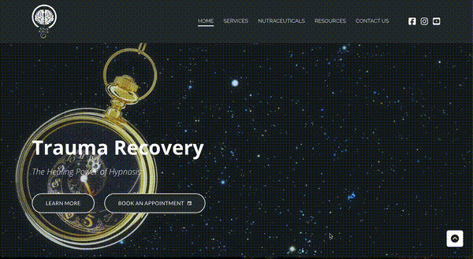
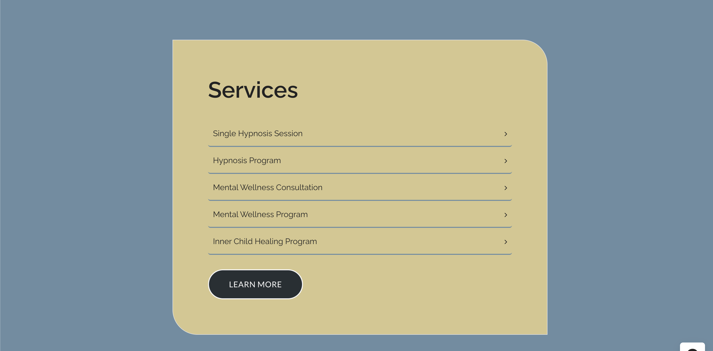
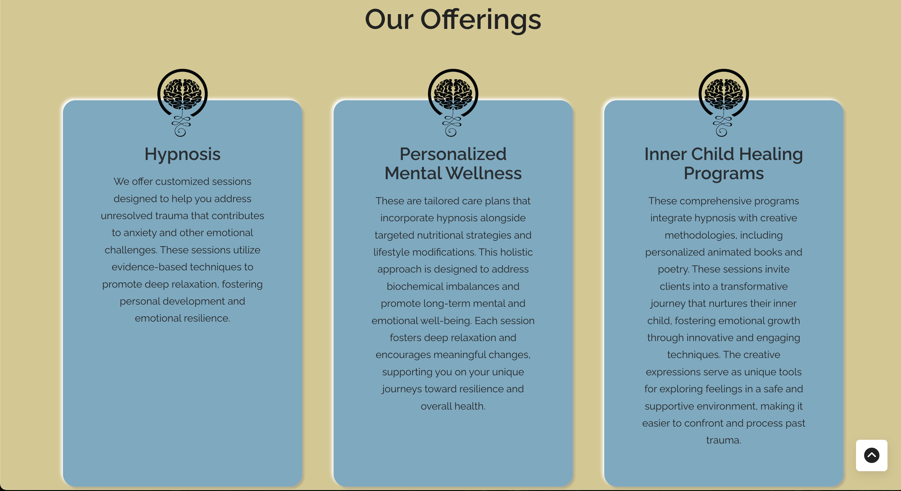
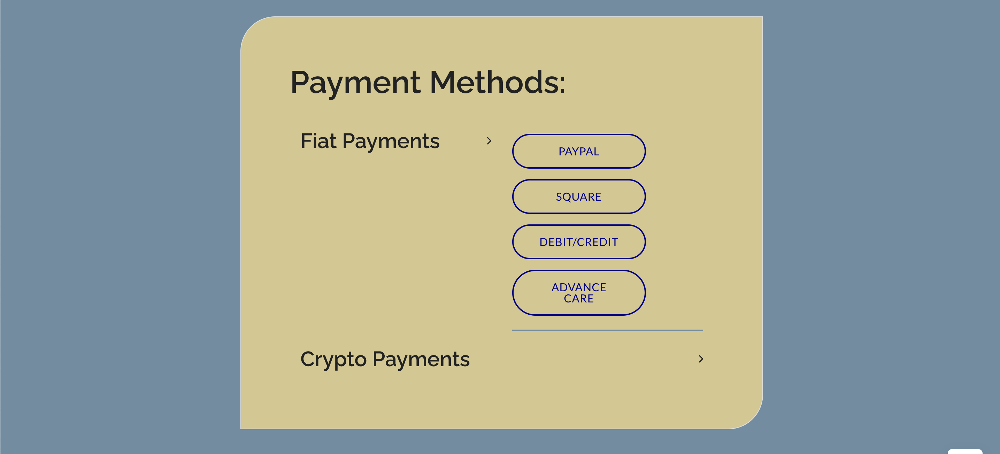
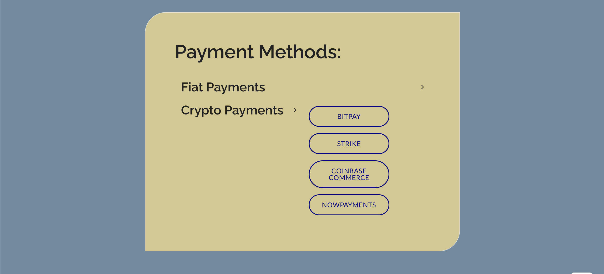
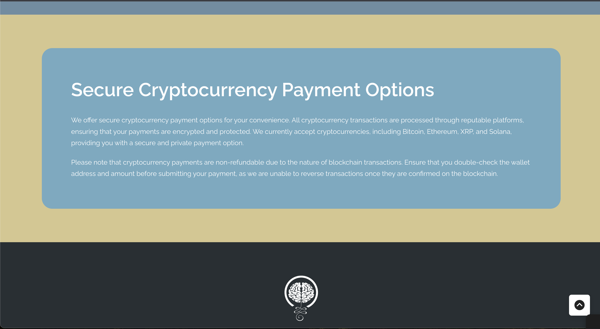

<h1 align="center">Anonymous Therapy Prototype</h1>

Archived portfolio artifact: privacy-first services with Web3 payments. Site retired; assets preserved for review.

## Highlights
- Animated hypnosis pendulum (engagement)
- Clear service structure (offerings)
- Fiat and crypto payment flows

## Demo

   
  <a href="assets/01_pendulum.mp4">Download MP4</a>

## Services

## Payments

## Skills Demonstrated
- **Web Design & UX:** Developed engaging hypnosis interface with custom animation.
- **Web3 Integration:** Implemented fiat and crypto payments (BitPay, Coinbase Commerce, NOWPayments).
- **Architecture & Delivery:** Built end-to-end service structure and deployed as a live prototype.
- **Portfolio Relevance:** Demonstrates ability to design, integrate, and retire production-ready features.
